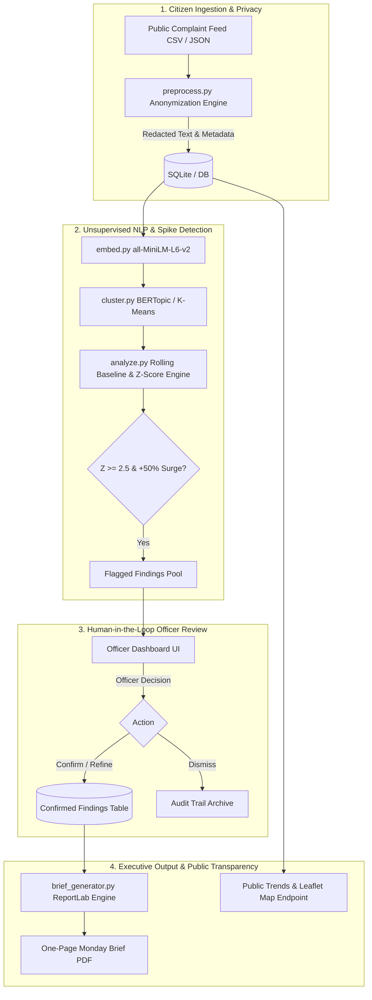

# Grievance Radar System Architecture

## Overview
Grievance Radar is designed around human-in-the-loop municipal data analytics. The architecture separates citizen data ingestion, statistical anomaly detection, officer verification, and executive briefing into distinct modular services.

## Architecture Diagram

## Architectural Boundaries

1. **Privacy Invariant**:
   Raw citizen phone numbers, Aadhaar numbers, and names never reach embedding models or the public trends view. Redaction is enforced in `app/services/preprocess.py` prior to database commit.

2. **Decoupled Fallback Clustering**:
   `cluster.py` leverages BERTopic when PyTorch/huggingface components are resident, but defaults seamlessly to high-speed Scikit-Learn K-Means with dynamic TF-IDF label generation if resources or memory limits are constrained.

3. **Strict Human Gatekeeper**:
   The Monday Brief PDF compilation endpoint (`/api/brief`) strictly filters `status == 'confirmed'`, guaranteeing that no unverified or false-positive statistical spike appears on the final executive brief.
